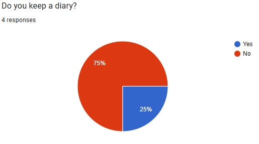
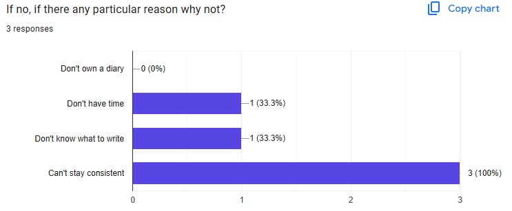
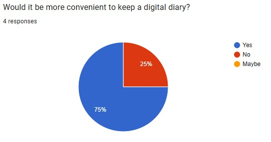
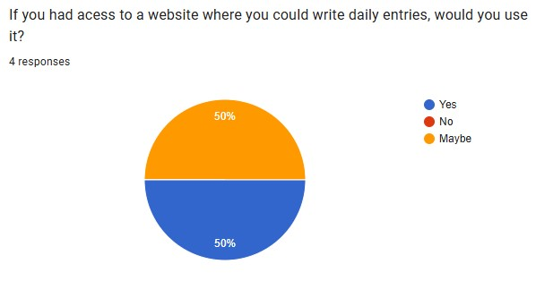
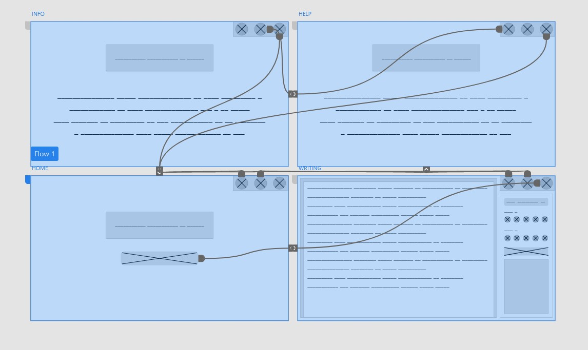
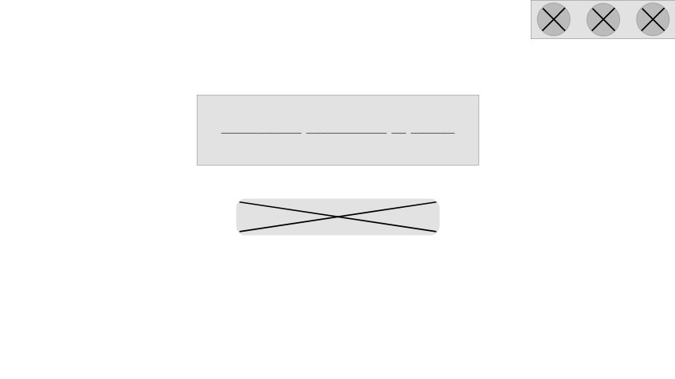
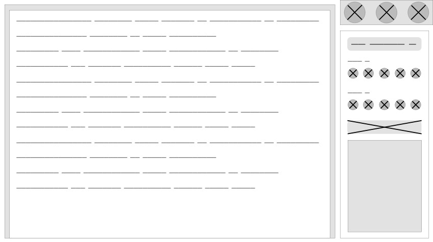
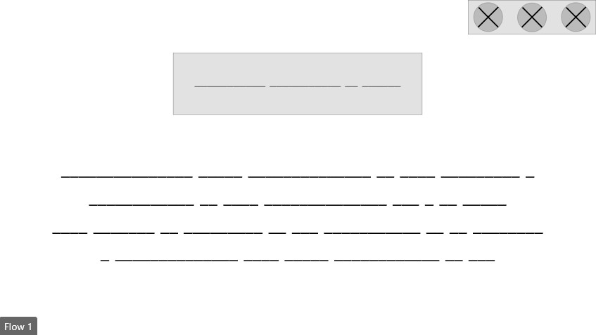

##### I may or may not slightly potentialy find the tedious and arduous tasks completed in the lesson time assigned to the course computing technology to be mildly infuratingly frustrating to all known students in the class currently alive. Be warned.
# 10 CT Task 2
## Divergent Thinking
## Convergent Thinking
### SWOT Analysis
#### **Idea 1 - Phone Use**
|Strengths|Weaknesses|Opportunities|Threats|
|-|-|-|-|
|everyone experiences this. helpful. reccomendations are really good cuz u stop the problem and then like also make a solution yk|maybe try being motivating rather than hating current life choices..|you can put like statristics yk like today u have spent this much time on this app.| be motivating|
|Has a clear somewhat positive impact and yeah|You'd have to be looking at your phone to see this though, also most people already have something like this in their settings|You could add little rewards if people reduce their screen time|idk but how are you going to measure ppls screen time|
|Really relevant and tackles a serious issue especially in our generation|I don't think people hating their life choices will make them a return user, people normally like to feel good when using an app|Maybe a feature that locks social media apps so users don't have a choice to give up on turning away from them|Some other anti-social media apps already exist and possibly work better than this one as they lock social media apps|
|With how pertinent this issue is to modern society, their is a definite need for something like this.|The effect of 'making you hate your current life choices' could be more likely to dissuade the app's usage rather than phone usage, which is of course, bad. Many phone addicts probably already know the negative effects so this may be redundant.|People do indeed hate their own life choices relating to their phones so there is certainly a market for this. Alternate activity recommendations could also be expanded into many useful ideas.|There is already an inbuilt way to track phone usage within your phone. Whilst the other features are definitely workable, that alone would not be.|
#### **Idea 2 - Digital Diary**
|Strengths|Weaknesses|Opportunities|Threats|
|-|-|-|-|
|thats true. u have a good reason and stuff. |idk|you can add stickers digital ones that u can paste on ur pages and stuff. or like if u want u can also have like an emotion tracker on each page/ or weather tracker thoingy, so u can click on what the weather or ur emtoions felt like on that day yk.|idk|
|Convenient, addresses a need, and achievable within the time frame|idk|You could add little digital stickers and stuff|uh yea stuff|
|Relevant and customisable, influences anyone especially those with bad memory or who want to have more gratitude|Might be a little boring if the only feature is being able to write|New features, themes, prompts, etc|Already been done by a few other apps|
|Convenient, addresses a need, and achievable within the time frame|I don't know how original the concept is, and if the market of people who want diaries would care to go digital.|There could be ways to enhance the functionality such as visual customisation. This concept is also seemingly quite unique.|Cybersecurity needs to be a big focus here as diaries are supposed to contain personal info. I would highly advise against any cloud systems.|
### Reflect And Choose
Fine. Fine. I’ll do the diary one. I just think it’s overall a more creative idea, and it appeals to a good audience. Better impact than the thousands of apps, websites etc that already exist to berate you about screentime. It also just overall has more potential. And it’s probably more of the sort of thing I myself would use. So, I’ll do that.
## Requirements Outline
### Functional Requirements  
**Typing** - There needs to be an interface in which people can type words in, otherwise the whole idea of a diary is redundant  
**Saving** - Work needs to be saved somewhere somehow. Users should likely be able to access previous texts. 
**Security** - There needs to be some level of security in the website so only users only have access to their texts.

> Or maybe it'll just be a website where people have all the tools to make a digital diary, and can choose to download the files to keep on their device. That may very much be more reasonable. In that case, the requirements outline will be as follows:  

**Typing** - There needs to be an interface in which people can type words in, otherwise the whole idea of a diary is redundant  
**Downloading** - Users are able to download the diary page(s) they've written.

### Non-Functional Requirements
**Stickers** - allows users to add stickers as a way to add more creativity to the diaries
**Colours** - Users can write in multiple colours, or maybe even highlight texts.
## Research And Planning

### Existing Ideas
|Website|Plus|Minus|Implication|
|-|-|-|-|
|Reddit|Very easy to navigate, has clear buttons and a visually appealing UI. Good colour scheming and an overall good layout.|Navigation between pages can be slightly difficult or not as smooth as other sites.|Good UI on each page, page to page layouts can be disjointing|
|Wikipedia|Very easy to use, has good link placements and visually appealing pop ups to go to other pages. Also has different headings you can click to scroll to.|Overall design of Wikipedia is rather bland, with little to no colour, and mostly text based. More focus on information than buttons and layout.|UI could be better visually, however the information is easy to take in and well organised|
|Wordle|Simple but effective design choices, with minimal but well placed buttons. The open/close sidebar is good as well as the animations|There is a loooooot of empty space. And similar to Wikipedia can be verrrry colourless with the near all white screen. The Hint button isn't clearly a link, which can be unusual.|It is a good example of simplicity, and well placed UI. However can be inconsistent with directions from buttons, some lead to a link, others are a dropdown, and others are a popup, and yet they all look the same.|
### Secondary Research
>Many sources show that writing a diary can be highly influential to one's life. It helps improve writing an communication skills whilst also supporting your mental health. And, in my opinion, most importantly it encourages creativity, which is something people seem to be severely lacking these days. Writing daily can really help people work through their thoughts, and it gives people a space to vent. And yet hardly enough people keep a diary lately.
>
>Sources say this could be due to a number of reasons, especially the idea that it has to be perfect. That and people feel to stuck on what to write. Some sort of encouragement would work well to ensure people don't just give up. Maybe have a list of prompts of which one is randomly selected and displayed(if I can figure out how to do that). Also, a page on the website with adivice on how to manage keeping a diary would give people a reason to keep writing? This would help keep people engaged.

### Primary Research
when asked about their diary habits, people responded with the following:  

  
This data not only shows that a majority of people do not keep a diary, but the leading reason as to why is people's lack of ability to stay consistent. Furthermore, when offered the idea of a digital diary, each person responded with at least a bit of positivity when asked if they'd use a digital diary.

### UI/UX Design
#### The UX is as follows:
  
#### These are the wireframes for the following pages
#### **Homepage**
    
#### **Writing Page**

#### **Info Page**

